>  style="width:1.71028in;height:0.41805in" />DRC Design Verification
> Test style="width:1.08472in;height:0.99947in" />
>
> 1
>
>  style="width:1.71028in;height:0.41805in" />DRC Design Verification
> Test

Table of Contents

<u>I</u>ntroduction 3

Specifica<u>ti</u>ons 4

DRC Block D<u>i</u>agram 4

Equ<u>i</u>pmen<u>t</u> Requ<u>ir</u>ed <u>f</u>or Tes<u>ti</u>ng 5

Test Board Ex<u>t</u>erna<u>l</u> Connecto<u>r</u>s D<u>i</u>agram 6

Test Board LED Diag<u>r</u>am 7

Test Board P<u>i</u>n Header Diagram 8

Test Board Default Jumper P<u>l</u>acement 9

DRC Edge Connector P<u>r</u>ogram/Debug Board 10

DVT Interposer Board 11

DRC Hookup D<u>i</u>agram 12

DRC Hookup Procedure 13

DRC Power Test & Ver<u>ifi</u>cation Procedure 14

Connec<u>ti</u>ng the DRC to a PC 15

DRC Test Procedure Overview 16-17

Test Mode 1: DRC s<u>t</u>a<u>t</u>us LED tes<u>t</u> 18

Test Mode 2: Se<u>t</u> a<u>l</u>l pins to D<u>i</u>g<u>i</u>tal paths
and cycle <u>I</u>O pins 19

Test Mode 3: Read <u>I</u>O P<u>i</u>ns and report state changes 20

Test Mode 4: Low speed DAC saw<u>t</u>ooth wave output<u>s</u> 21

Test Mode 5: Low speed DAC square wave outputs<u>.</u> Trans<u>it</u>ion
<u>t</u>ime test 22-23

Test Mode 6: High speed ADC/DAC loopback mode A 24

Test Mode 7: High speed ADC/DAC loopback mode B 25

Test Mode 8: High speed DAC Output and Quad. Modu<u>l</u>ation Test
26-27

Creating a V<u>iti</u>s Project 28-31

Preparing a Boo<u>t</u> <u>I</u>mage 32-33

Programming QSPI F<u>l</u>ash 34-35

> 2

DRC Design Verification Test
Introduction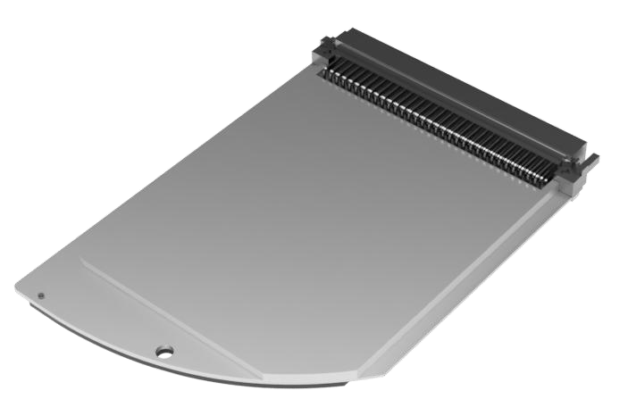

This DVT serves to provide the hardware verification procedure to test
all circuitry contained within the DRC.

Hardware Support

The following part numbers are support by the highest level version of
the DVT below.

||
||
||
||

Changelog

||
||
||
||
||

> 3

DRC Design Verification Test
Specifications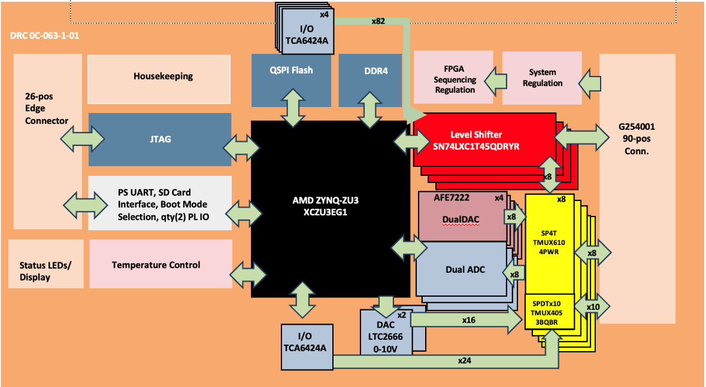

> • Xilinx Zynq Ultra-Scale+ MPSoC ZU3, XCZU3EG1
>
> • Quad, ARM® Cortex™-A53 Processors
>
> • Dual, Arm Cortex R5 Real-Time Processors
>
> • ARM Mail 400, GPU
>
> • 8-Channel High Speed 65 MSPS ADCs
>
> • 8-Channel High Speed 130 MSPS DACs
>
> • 16-Channel Low Speed DACs , 0 to 10V
>
> • 2 GB DDR4
>
> • 128 MB quad SPI flash
>
> • JTAG edge connector
>
> • 90-pin G254001 Backplane Connector
>
> • -40C to 85C Operation
>
> • (+15V, -15V, +5V) OR (+5V only) Input
>
> • Power dissipation between 5W and 8W (12W w/ 2 HSDAC channels active)

DRC Block Diagram

> 4

DRC Design Verification Test
Equipment Required for Testing

Test assembly:

> 1\) DRC Rev. 2.1 2) Test Board
>
> 3\) Prototype Chassis
>
> 4\) Test Board to DVT Interposer Board Cable 5) DVT Interposer Board
>
> 6\) Power Brick
>
> 7\) USB C to USB A Cable (x2) 8) USB C to USB C Cable
>
> 9\) DRC edge connector Program/Debug Board

0C-202-1-03 0C-203-1-01 0C-204-1-01 0C-212-1-01 0C-205-1-01 0C-206-1-01
0C-207-1-01 0C-208-1-01

0C-210-1-01

> 10\) DRC JTAG Programmer (Modified HS3 Cable) 0C-211-1-01

Equipment:

> 1\) Signal generator 2) Oscilloscope
>
> 3\) Computer
>
> 4\) TeraTerm(or similar) 5) Vivado 2023.1
>
> 6\) Vitis 2023.1
>
> 5
>
>  style="width:1.71028in;height:0.41805in" />DRC Design Verification
> Test

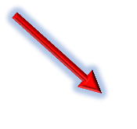Test Board External
Connectors Diagram J3: USB C data connection J2: USB C Power input

> Use 20V capable brick
>
> J37: Connector to interface with DRC 90 pin connector
>
> 6

DRC Design Verification Test
Test Board LED Diagram

> 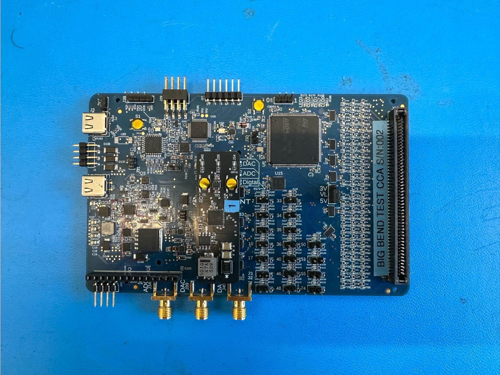 style="width:6.52014in;height:8.69347in" /> style="width:0.88083in;height:0.47918in" /> style="width:0.82251in;height:0.94251in" /> style="width:1.55417in;height:2.43583in" /> style="width:1.64583in;height:0.44585in" /> style="width:0.93583in;height:1.22251in" />3.3V Power LED
>
> Programming LEDs
>
> Future Use
>
> Mode LEDs:
>
> Green = ADC
>
> Red = DAC
>
> Both = Digital
>
> 7
>
>  style="width:1.71028in;height:0.41805in" />DRC Design Verification
> Test

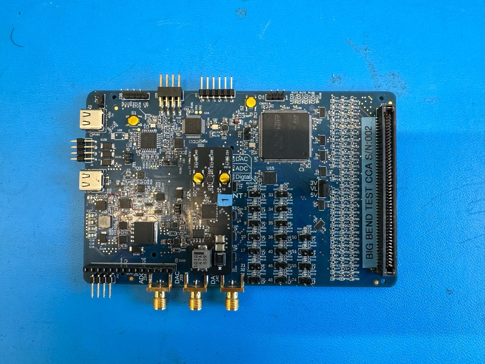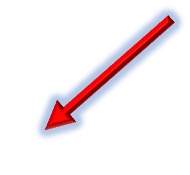Test Board Pin Header Diagram

> J43: Internal Power Outputs
>
> GND
>
> -15V
>
> 15V
>
> 5V

J31: USB HUB RST

> J36: Reserved

J1: External Power Inputs

5V \| 15V \| -15V \| GND v

> J32: Reserved
>
> J38: Reserved
>
> J29: Programming Jumpers
>
> J30: UART
>
> TX RX
>
> J27: ST Link SWD Connections
>
> Do Not Use
>
> J26: Boot Mode Jumper
>
> J5: Logic Voltage:
>
> NOTE: KEEP AT 5V
>
> 8
>
>  style="width:1.71028in;height:0.41805in" />DRC Design Verification
> Test

Test Board Default Jumper Placement

> 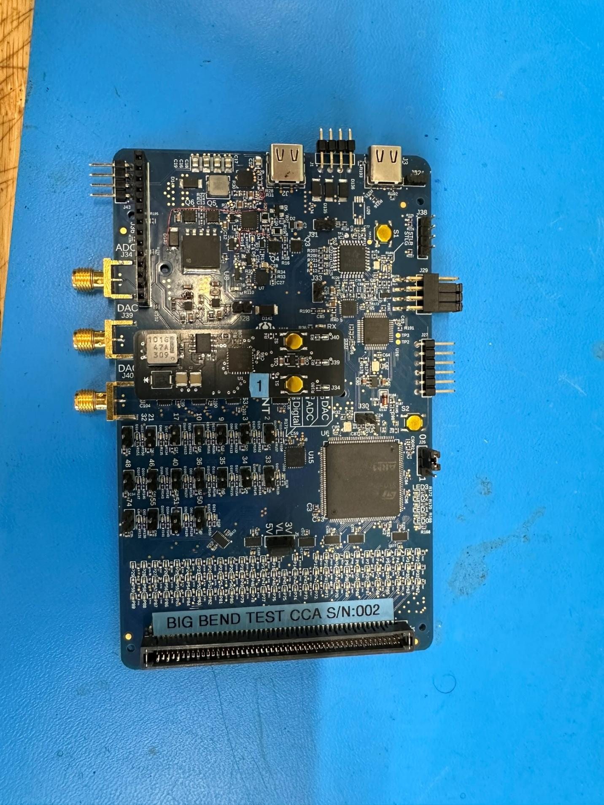 style="width:0.68583in;height:0.46587in" /> style="width:0.68418in;height:0.46753in" /> style="width:1.83083in;height:1.97417in" />J29: Default state
>
> Connections between application MCU and programmer
>
> J26: Default state
>
> 0 (default) : Set to 0 to run application or program device
>
> 1: bootloader -\> erase flash in case of boot failure
>
> J5: Default state
>
> Keep jumper at logic 5V. DRC runs at 5V and will damage test board if
> set to 3.3V.
>
> 9
>
>  style="width:1.71028in;height:0.41805in" />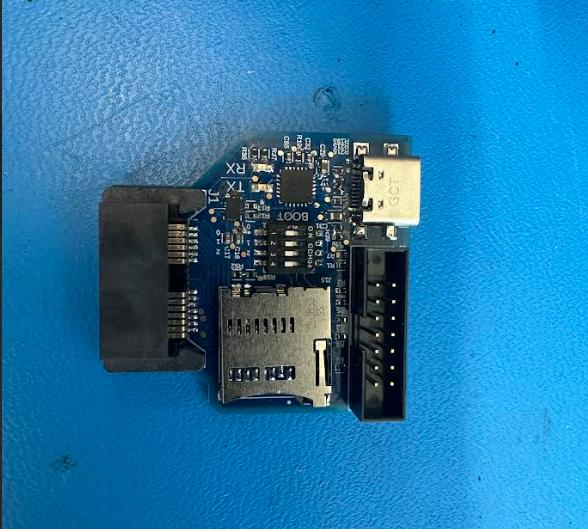 style="width:6.12569in;height:5.51111in" /> style="width:1.6325in;height:1.3725in" /> style="width:1.6475in;height:1.49583in" /> style="width:1.26917in;height:0.99918in" /> style="width:1.10918in;height:1.37085in" /> style="width:1.05083in;height:2.44083in" />DRC Design Verification
> Test

DRC Edge Connector Program/Debug Board

SD Card slot for SD Card Boot

> HS3 JTAG Port
>
> J1: 26 POS connector mating to DRC edge connector.
>
> USB Type C for Power & UART
>
> BOOT Mode Selection Jumpers:
>
> QSPI :
>
> JTAG :
>
> SD CARD :

OFF OFF OFF OFF

OFF ON OFF OFF

ON OFF ON OFF

> 10
>
>  style="width:1.71028in;height:0.41805in" />DRC Design Verification
> Test
>
> 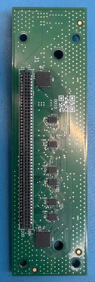 style="width:2.51083in;height:1.8175in" />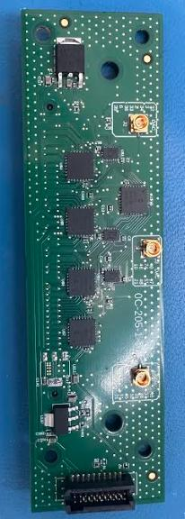 style="width:5.99792in;height:2.14167in" /> style="width:1.07085in;height:2.18083in" /> style="width:0.65583in;height:2.36417in" /> style="width:0.73751in;height:2.1475in" /> style="width:0.97418in;height:1.25917in" />DVT Interposer Board J1 :
> Connector to 90 pin interposer board.

J2 : DAC Output SMPM

Connects to Pins:

32

3

34

2

33

36

6

35

J3 : DAC Output SMPM

Connects to Pins:

40

74

46

10

17

51

48

21

J4 : ADC Input SMPM

Connects to Pins:

46

17

48

33

60

55

51

21

20 POS Connector to Test Board.

> 11
>
>  style="width:1.71028in;height:0.41805in" />DRC Design Verification
> Test

DRC Hookup Diagram

> 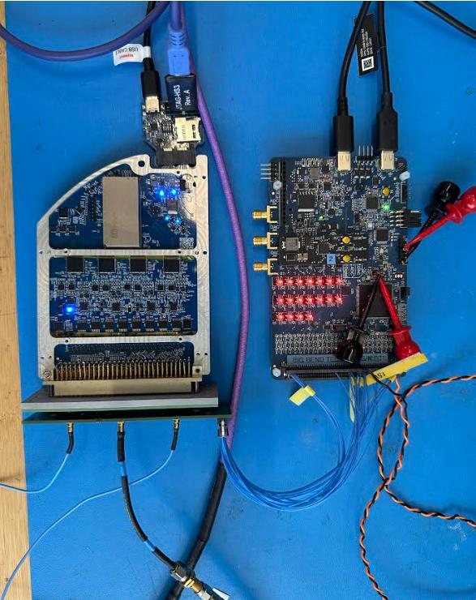 style="width:6.11514in;height:7.70903in" /> style="width:2.11583in;height:1.63583in" /> style="width:0.79418in;height:0.5575in" /> style="width:1.31251in;height:1.25083in" /> style="width:1.78417in;height:0.57086in" /> style="width:0.44418in;height:0.74751in" /> style="width:0.44418in;height:0.57753in" /> style="width:3.73583in;height:1.7575in" /> style="width:0.98251in;height:0.58418in" /> style="width:1.28083in;height:1.36583in" /> style="width:1.42083in;height:1.11917in" /> style="width:3.56583in;height:1.2275in" /> style="width:2.34583in;height:2.5125in" /> style="width:0.67583in;height:2.38583in" /> style="width:0.99918in;height:2.45083in" />USB C – PC Connection

Micro USB Cable – PC Connection

USB C to USB C cable for power

> HS3 JTAG
>
> Programmer USB C – PC Connection
>
> 0C-202-1-03
>
> DRC R2.1

0C-210-1-01

Edge Connector Interface Program/Debug Board

0C-203-1-01

Test Board

> 0C-212-1-01 Interposer to Test Board Cable
>
> 0C-204-1-01 (ships with chassis)
>
> 0C-205-1-01
>
> DVT Interposer Board
>
> Connection to OScope

Connection to OScope

Connection to Function Generator

> 12
>
>  style="width:1.71028in;height:0.41805in" />DRC Design Verification
> Test

DRC Hookup Procedure

> 1\) Connect the DVT Interposer Board to the 90-Pin Connector
> Interposer Board (this will be mounted to the chassis).
>
> 2\) Connect the Ribbon Cable between the Test Board and the DVT
> Interposer Board
>
> 3\) Slide the DRC into the Chassis and connect to the 90-Pin Connector
> Interposer board.
>
> 4\) Make sure the Test Board and its Daughter Board have good
> connection. If this was removed and reseated, make sure the pin
> headers/connectors are properly aligned, and that all pins are in
> their sockets.
>
> 5\) Connect the DRC edge connector Program/Debug Board to the DRC by
> mounting onto the DRC’s edge connector opposite of the 90-pin
> connector.
>
> 6\) Connect the Modified HS3 Programmer to the DRC edge connector
> Program/Debug Board. a. Note: Can use unmodified HS3 programmer if USB
> C connected.
>
> 7\) Connect the HS3 Programmer to a PC via a Micro USB to USB A cable.
>
> 8\) Connect the DRC edge connector Program/Debug Board to a PC with a
> USB C to USB A cable. 9) Connect the Test Board to a PC with a USB C
> to USB A cable on J3.
>
> 10\) Set the boot mode jumper to QSPI boot. BOOT DIP SWITCH -\> (OFF
> OFF OFF OFF)
>
> 11\) Connect J2 on the DVT Interposer Board to CH1 on an Oscilloscope
> through an SMPM to BNC cable. 12) Connect J3 on the DVT Interposer
> Board to CH3 on an Oscilloscope through an SMPM to BNC cable. 13)
> Connect J4 on the DVT Interposer Board to a function generator through
> an SMPM to BNC cable. 14) Connect the PD Power Brick to a receptacle.
>
> 15\) Apply power to the system by connecting a USB C to USB C cable
> from the PD Power Brick to the Power connector on the Test Board.
>
> 16\) Verify that the system powers up.
>
> 17\) Check the edge mounted LEDs on the DRC for activity. With the
> default program, LED3 should be ON and LED1, LED2, and LED4 should be
> OFF on startup.
>
> 13
>
>  style="width:1.71028in;height:0.41805in" />DRC Design Verification
> Test

DRC Power Test and Verification Procedure

> 1\) 90 Pin Connector
>
> a\. Between 90-pin connector GND (Pin 1, 31, or 61) and 5V (Pin 30,
> 60, or 90), verify 5V is present b. Between 90-pin connector GND (Pin
> 1, 31, or 61) and 15V (Pin 13), verify 15V is present
>
> c\. Between 90-pin connector GND (Pin 1, 31, or 61) and -15V (Pin 15),
> verify -12V is present. The test fixture provides -12V on this pin.
>
> 2\) OSDZU3EG SiP Internal Regulation Test Points
>
> 1\. Verify the following voltages at each test point in the table

||
||
||
||
||
||
||
||
||
||
||
||
||

> 14
>
>  style="width:1.71028in;height:0.41805in" />DRC Design Verification
> Test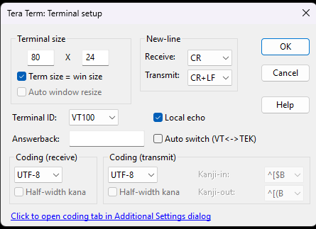 style="width:4.63542in;height:3.36458in" />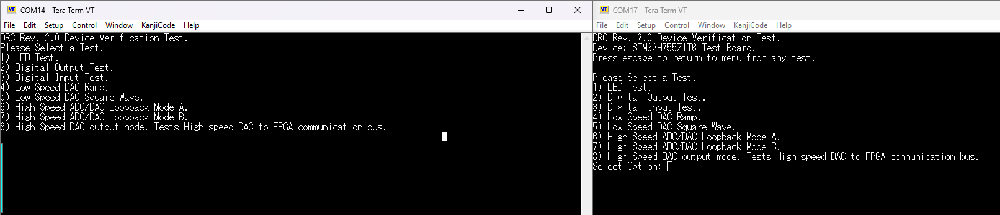

Connecting the DRC to a PC

> 1\) Make sure the Edge Connector Interface Program/Debug Board and the
> Test Board are connected to a PC.
>
> a\. NOTE: You may get an unknown device error from the Test Board.
> This is OK as long as a USB to UART bridge is enumerated.
>
> 2\) Open 2 sessions of Teraterm and connect to both serial ports. 3)
> Set the baud rate of both sessions to 115200.
>
> 4\) Navigate to Setup-\>Terminal and use these setings: Local Echo ON
> and Transmit is CR+LF.
>
> 5\) Since the board has already booted, you will not see any terminal
> output. Remove power from the DRC and reapply power without closing
> the terminal session.
>
> 6\) A list of tests will now be loaded into the terminals. The
> following section will describe each test. You should see this on the
> terminals. Left is the Test Board output and Right is the DRC output.
>
> 7\) For each test, Both the Test Board and the DRC must be set to the
> same test mode. Operating different tests at the same time may cause
> unpredictable behavior. The DRC is line buffered, so ENTER must be
> pressed after sending commands, while the Test Board will act upon
> keyboard input in real time.
>
> 15
>
>  style="width:1.71028in;height:0.41805in" />DRC Design Verification
> Test

DRC Test Procedure Overview

For each test, the edge mounted LEDs on the DRC and the 4 status LEDs on
the Test Board will indicate the current test. For example, in test mode
2, The DRC LEDs will illuminate 0010 and the Test Board LEDs will
illuminate 0010. For both the Test Board and the DRC, the test mode must
be selected using each board’s

Test Mode 1: Cycles edge mounted LEDs on the DRC

> \- Summary: Outputs a pattern on the status LEDs - Verification:
>
> o Edge mounted LEDs and control circuitry

Test Mode 2: Set all pins to Digital paths and cycle IO pins.

> \- Summary: This test will first set all multipurpose pins’ paths
> (SP4T or SPDT switches) to digital mode, whose signal path is FPGA
> (PL) -\> Level Translator -\> switch -\> 90 pin connector. Afterward,
> the IO pins will turn on and off one at a time, ending with all IO
> pins being turned on for the duration of the runtime parameter.
>
> \- Verification:
>
> o SPDT switch digital paths o SP4T switch digital paths o IO expander
> control
>
> o Level shifters o IO pins

Test Mode 3: Read IO Pins and report state changes.

> \- Summary: This test will first set all multipurpose pins’ paths
> (SP4T or SPDT switches) to digital mode, whose signal path is 90 pin
> connector -\> switch -\> Level translator -\> FPGA (PL). Afterward,
> the DRC will read each IO pin state on the 90 pin connector, and
> report all state changes on the pins. If the DRC reads at least one
> transition on each IO pin, a success message will be displayed. If
> not, the DRC will list out any pins that failed to transition.
>
> \- Verification:
>
> o SPDT switch digital paths o SP4T switch digital paths o IO expander
> control
>
> o Level shifters o IO pins

Test Mode 4: Low speed DAC sawtooth wave outputs

> \- Summary: This test will first set all multipurpose pins’ paths
> (SP4T or SPDT switches) to Low Speed DAC mode, whose signal path is
> Low Speed DAC channel -\> switch -\> 90 pin connector Afterward, the
> DRC will send commands to all 16 Low Speed DAC channels to output a
> low frequency sawtooth wave.
>
> \- Verification:
>
> o SPDT switch analog paths o SP4T switch analog paths
>
> 16
>
>  style="width:1.71028in;height:0.41805in" />DRC Design Verification
> Test o IO expander control
>
> o Low Speed 8-channel DACs o SPI control lines

Test Mode 5: Low speed DAC square wave outputs. Transition time test.

> \- Summary: This test will first set all multipurpose pins’ paths
> (SP4T or SPDT switches) to Low Speed DAC mode, whose signal path is
> Low Speed DAC channel -\> switch -\> 90 pin connector Afterward, the
> DRC will send commands to all 16 Low Speed DAC channels to cycle
> between 0V and 10V.
>
> \- Verification:
>
> o SPDT switch analog paths o SP4T switch analog paths o IO expander
> control
>
> o Low Speed 8-channel DACs o SPI control lines
>
> o \< 2.5us transition time (10V/2.5us slew rate)

Test Mode 6: High speed ADC/DAC <u>loopback</u> mode A.

> \- Summary: Tests channel A on each ADC/DAC pair. Since some High
> Speed ADC and High Speed DAC channels share a multifunction pin,
> testing channel A and B for the converters will be done in separate
> tests.
>
> \- Verification:
>
> o SP4T switch analog paths o IO expander control
>
> o High Speed Converters (A Channels)

Test Mode 7: High speed ADC/DAC <u>loopback</u> mode B.

> \- Summary: Tests channel A on each ADC/DAC pair. Since some High
> Speed ADC and High Speed DAC channels share a multifunction pin,
> testing channel A and B for the converters will be done in separate
> tests.
>
> \- Verification:
>
> o SP4T switch analog paths o IO expander control
>
> o High Speed Converters (B Channels)

Test Mode 8: High speed DAC O<u>utput mode. DAC Output and Quadrature
Generation.</u>

> \- Summary: Tests all HSDAC outputs. During this test, the DACs will
> generate either a square wave (Mixing Disabled) or sine wave (Mixing
> enabled). This test tests 1 AFE DAC pair at a time.
>
> \- Verification:
>
> o SP4T switch analog paths o IO expander control
>
> o High Speed DACs
>
> o FPGA to AFE7222 communication
>
> 17
>
>  style="width:1.71028in;height:0.41805in" />DRC Design Verification
> Test

Test Mode 1: Set DRC Edge Mounted Status LEDs to 0001

> 1\) When prompted to input a test mode, type “1” and press enter on
> the DRC console. No need to enter anything into the Test Board
> console.
>
> 2\) The DRC status LEDs will cycle in the following order: 0001
>
> 0010 0100 1000 0100 0010 0001
>
> 3\) Check that the status LEDs ends at 0001, indicating test mode 1.
> If so, the test is successful.
>
> 18
>
>  style="width:1.71028in;height:0.41805in" />DRC Design Verification
> Test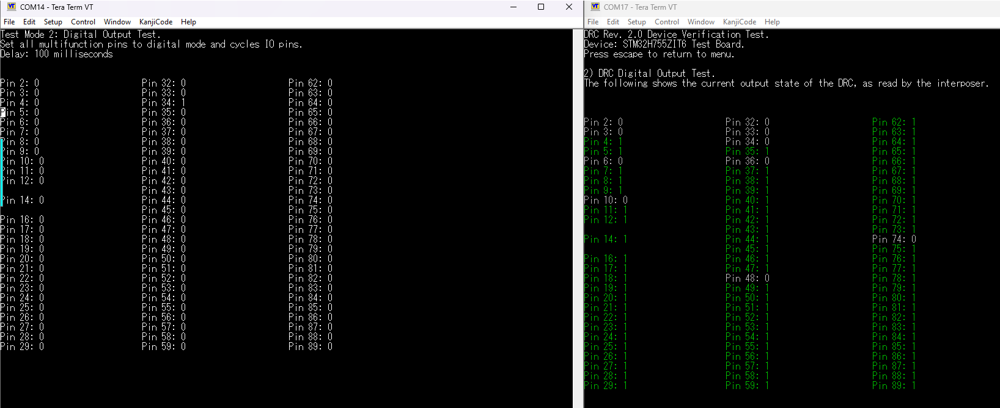

Test Mode 2: Set all pins to Digital paths and cycle IO pins.

This test will first set all multipurpose pins’ paths (SP4T or SPDT
switches) to digital mode, whose signal path is FPGA (PL) -\> Level
Translator -\> switch -\> 90 pin connector. The IO expanders are also
programmed to set the level shifters into output mode. Afterward, the IO
pins will turn on and off one at a time, will a delay of the runtime
amount, in milliseconds, ending with all IO pins being turned on and
then back off.

> 1\) When prompted to input a test mode on the DRC console, type “2”
> and press enter.
>
> 2\) You will be prompted to enter a delay. Each pin will toggle HIGH,
> then LOW. This delay is the delay, in ms, between testing each pin. A
> value of 500-2000 is suficient. Enter the delay. Do not press enter
> yet.
>
> 3\) On the Test Board Console, press “2”. The Test Board will be
> configured for mode 2 without pressing enter. 4) Press enter on the
> DRC console.
>
> 5\) You will now see this:
>
> 6\) Verify, on the Test Board console, that each pin is transitioning
> from HIGH to LOW, and from LOW to HIGH. If any pin fails to change
> state in its turn, the digital output test fails.
>
> 7\) Verify that the Test Board status LEDs indicate 0010.
>
> 8\) If all IO pins are functional, the DRC outputs have been
> successfully verified.
>
> 9\) The DRC Console will automatically return to the menu. Press
> escape on the Test Board console to return to the menu.
>
> 19
>
>  style="width:1.71028in;height:0.41805in" />DRC Design Verification
> Test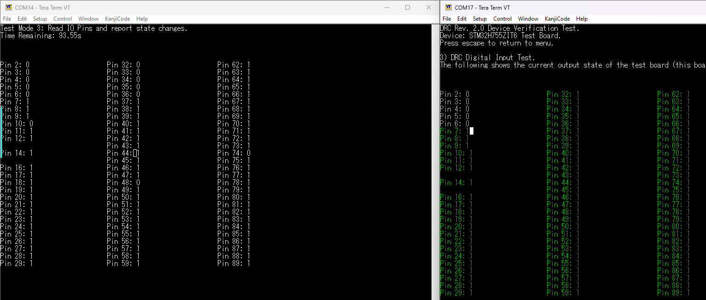

Test Mode 3: Read IO Pins and report state changes.

This test will first set all multipurpose pins’ paths (SP4T or SPDT
switches) to digital mode, whose signal path is 90 pin connector -\>
switch -\> Level translator -\> FPGA (PL). The IO expanders are also
programmed to set the level shifters into input mode. Afterward, the DRC
will read each IO pin state on the 90 pin connector, and report the
state of all pins.

> 1\) When prompted to input a test mode on the DRC console, type “3”
> and press enter.
>
> 2\) You will be prompted to enter a runtime. This is the length, in
> seconds, in which the DRC will probe the input pins. A value of 10-60s
> is suficient. Do not press enter yet.
>
> 3\) On the Test Board Console, press “3”. The Test Board will be
> configured for mode 3 without pressing enter. 4) Press enter on the
> DRC console.
>
> 5\) The following should be shown on the consoles(Will see some
> variation).
>
> 6\) Verify that the DRC status LEDs indicate 0011.
>
> 7\) Verify that the Test Board status LEDs indicate 0011.
>
> 8\) The Test Board will now output different states on the IO pins and
> displays its outputs on the Test Board console. The DRC will read
> these pins and display the states read on the DRC console. Verify that
> both consoles show the same activity and are synchronized.
>
> 9\) If the test succeeds, the DRC inputs have been successfully
> verified.
>
> 10\) Press escape on the Test Board console to go back to the menu.
> The DRC console will time out after the length of the test has passed.
>
> 20

DRC Design Verification Test
Test Mode 4: Low speed DAC sawtooth wave
outputs.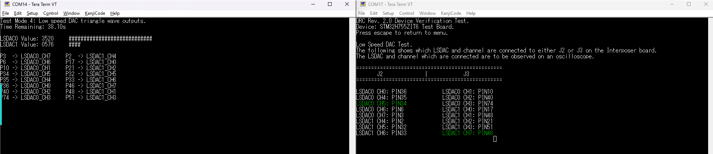

This test will first set all multipurpose pins’ paths (SP4T or SPDT
switches) to Low Speed DAC mode, whose signal path is Low Speed DAC
channel -\> switch -\> 90 pin connector Afterward, the DRC will send
commands to all 16 Low Speed DAC channels to output a low frequency
sawtooth wave.

> 1\) Type “4” on the Test Board console to enter into mode 4. 2) Type
> “4” on the DRC console and press enter.
>
> 3\) You will be prompted to enter a runtime. This is the length, in
> seconds, in which the DRC will output the LSDAC values. Test cannot be
> changed until this test times out. A value of 10-60 is recommended.
>
> 4\) The DRC console will show the LSDAC connections and the current
> value of each LSDAC set. The Test Board will route each LSDAC output
> to either J2 or J3, so that the signals are viewable on an
> oscilloscope. The Test Board console will show which LSDAC channel is
> currently connected, in green.
>
> 5\) Verify that the DRC status LEDs indicate 0100. 6) that the Test
> Board status LEDs indicate 0100.
>
> 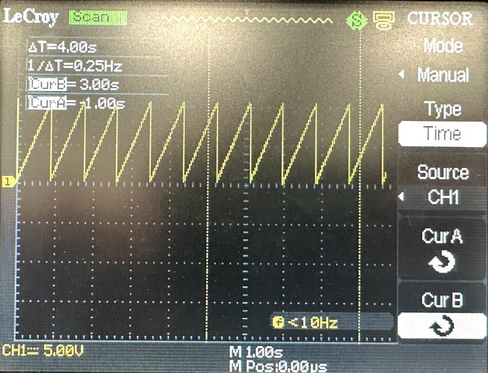 style="width:3.72778in;height:2.84305in" />7) Using an oscilloscope,
> verify that a low frequency sawtooth wave is generated on each pin as
> its turn in the sequence comes up.
>
> 8\) This test is meant to measure linearity, as well as min/max
> voltages. Verify 0-10V and a linear slope. Firmware may have different
> sawtooth wave, but checking for linearity and voltage range is the
> requirement.
>
> 9\) If all Low Speed DAC channels have been verified, move on to test
> mode 5.
>
> 21
>
>  style="width:1.71028in;height:0.41805in" />DRC Design Verification
> Test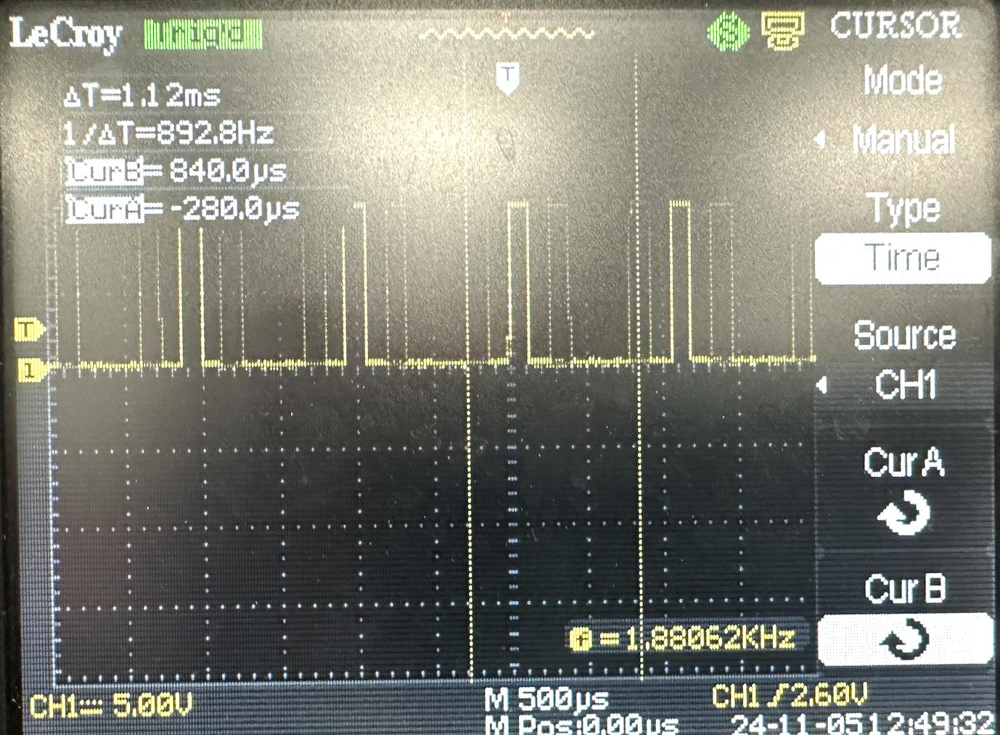 style="width:5.56292in;height:4.09375in" />

Test Mode 5: Low speed DAC square wave outputs. Transition time test.

This test will first set all multipurpose pins’ paths (SP4T or SPDT
switches) to Low Speed DAC mode, whose signal path is Low Speed DAC
channel -\> switch -\> 90 pin connector Afterward, the DRC will send
commands to all 16 Low Speed DAC channels to cycle between 0V and 10V.

> 1\) Type “5” on the Test Board console to enter into mode 5. 2) Type
> “5” on the DRC console and press enter.
>
> 3\) You will be prompted to enter a runtime. This is the length, in
> seconds, in which the DRC will output the LSDAC values. Test cannot be
> changed until this test times out. A value of 10-60 is recommended.
>
> 4\) The DRC console will show the LSDAC connections and the current
> value of each LSDAC set. The Test Board will route each LSDAC output
> to either J2 or J3, so that the signals are viewable on an
> oscilloscope. The Test Board console will show which LSDAC channel is
> currently connected, in green.
>
> 5\) Verify that the DRC status LEDs indicate 0101.
>
> 6\) Using an oscilloscope, verify that a square wave is generated on
> each pin that is set to Low Speed DAC mode (16 pins total). This the
> switching between LSDAC channels will be identical to the method shown
> in test mode 4.
>
> 22
>
>  style="width:1.71028in;height:0.41805in" />DRC Design Verification
> Test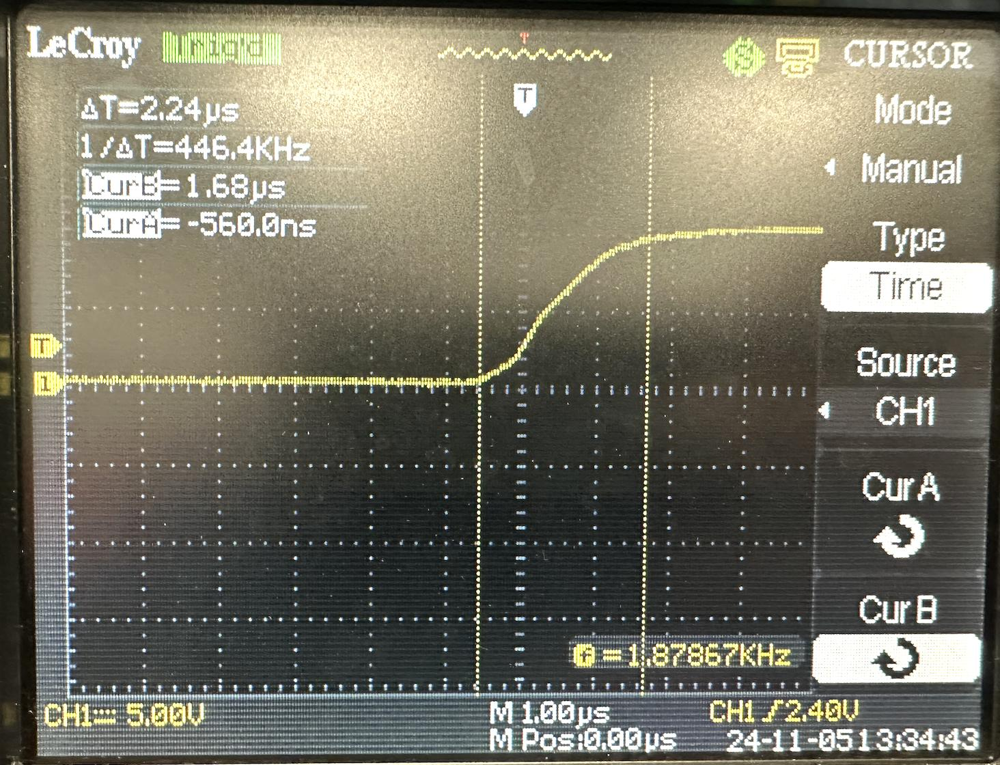 style="width:5.45417in;height:4.17278in" />

1\) On each channel, zoom in and verify the transition rate is sharp as
seen below.

11\) If all Low Speed DAC channels have been verified, move on to test
mode 6.

> 23
>
>  style="width:1.71028in;height:0.41805in" />DRC Design Verification
> Test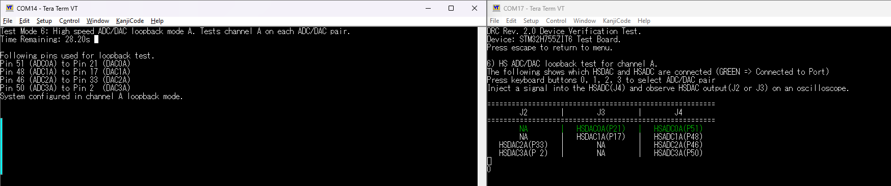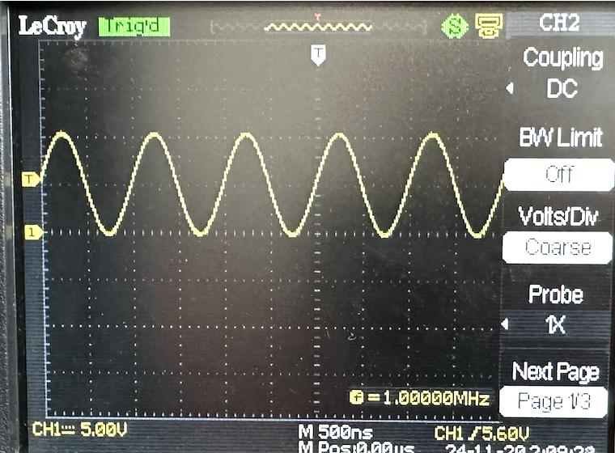 style="width:3.64167in;height:2.68333in" />

Test Mode 6: High speed ADC/DAC <u>loopback</u> mode A.

Tests channel A on each ADC/DAC pair. Since some High Speed ADC and High
Speed DAC channels share a multifunction pin, testing channel A and B
for the converters will be done in separate tests.

> 1\) Connect a function generator into J4 on the DVT interposer and set
> the frequency to 1MHz sine wave, at 10Vpp, with a 5V offset. In other
> words, a 1MHz signal from 0-10V.
>
> 2\) Connect J2 and J3 to an oscilloscope as done in previous tests. 3)
> Type “6” on the Test Board console to enter into mode 6.
>
> 4\) Type “6” on the DRC console and press enter.
>
> 5\) You will be prompted to enter a runtime. This is the length, in
> seconds, in which the DRC will remain in loopback mode. Test cannot be
> changed until this test times out. A value of 10-60 is recommended.
> Press enter.
>
> 6\) Verify that the DRC status LEDs indicate 0110. 7) that the Test
> Board status LEDs indicate 0110. 8) The following output should be
> observed:
>
> 9\) On the Test Board console, pressing 0, 1, 2, 3 will highlight a
> different row, in green. The selected row will indicate which
> connections are made. For example, pressing 0, as seen above, connects
> HSADC0A(P51) to J4, or the function generator, and HSDAC0A(P21) to J3,
> or the oscilloscope channel.
>
> 10\) Go through each row, and verify that the scope shows the DRC
> outputing a 1MHz sine wave from -5V to 5V.
>
> 11\) Once all Channel A ADC/DAC pairs are verified, move on to test
> mode 7.
>
> 24
>
>  style="width:1.71028in;height:0.41805in" />DRC Design Verification
> Test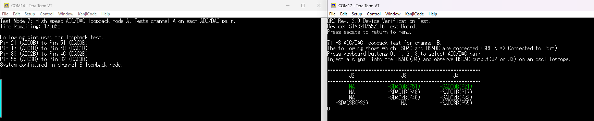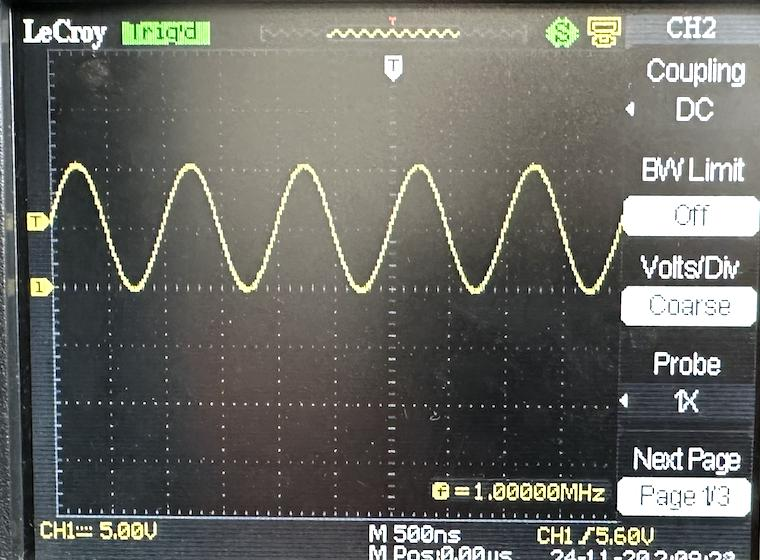 style="width:3.64167in;height:2.68333in" />

Test Mode 7: High speed ADC/DAC <u>loopback</u> mode B.

Tests channel B on each ADC/DAC pair. Since some High Speed ADC and High
Speed DAC channels share a multifunction pin, testing channel A and B
for the converters will be done in separate tests.

> 1\) Connect a function generator into J4 on the DVT interposer and set
> the frequency to 1MHz sine wave, at 10Vpp, with a 5V offset. In other
> words, a 1MHz signal from 0-10V.
>
> 2\) Connect J2 and J3 to an oscilloscope as done in previous tests. 3)
> Type “7” on the Test Board console to enter into mode 7.
>
> 4\) Type “7” on the DRC console and press enter.
>
> 5\) You will be prompted to enter a runtime. This is the length, in
> seconds, in which the DRC will remain in loopback mode. Test cannot be
> changed until this test times out. A value of 10-60 is recommended.
> Press enter.
>
> 6\) Verify that the DRC status LEDs indicate 0111. 7) that the Test
> Board status LEDs indicate 0111. 8) The following output should be
> observed:
>
> 9\) On the Test Board console, pressing 0, 1, 2, 3 will highlight a
> different row, in green. The selected row will indicate which
> connections are made. For example, pressing 0, as seen above, connects
> HSADC0B(P21) to J4, or the function generator, and HSDAC0B(P51) to J3,
> or the oscilloscope channel.
>
> 10\) Go through each row, and verify that the scope shows the DRC
> outputing a 1MHz sine wave from -5V to 5V.
>
> 11\) Once all Channel B ADC/DAC pairs are verified, move on to test
> mode 8.
>
> 25
>
>  style="width:1.71028in;height:0.41805in" />DRC Design Verification
> Test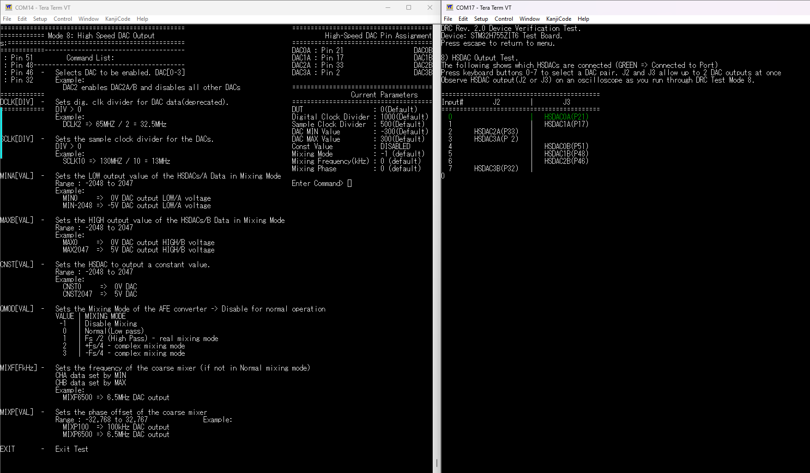

Test Mode 8: H<u>i</u>gh speed DAC Output and Quadrature Modulation Test

This mode will test the HSDAC channels. There is the flexibility to
change amplitude, frequency, and modulation modes.

> 1\) Connect J2 and J3 to an oscilloscope as done in previous tests. 2)
> Type “8” on the Test Board console to enter into mode 8.
>
> 3\) Type “8” on the DRC console and press enter. 4) Verify that the
> DRC status LEDs indicate 1000. 5) that the Test Board status LEDs
> indicate 1000. 6) The following output should be observed:
>
> 7\) On the Test Board console, pressing 0 through 7 will highlight a
> different row, in green. The selected row will indicate which
> connections are made. For example, pressing 0, as seen above, connects
> HSDAC0A(P21) to J3, or the, or the oscilloscope channel.
>
> 8\) On the DRC console, there are different commands that can be used,
> and their usage is listed in the console output. The DRC will only
> enable a single converters frontend at a time, and the command
> “DAC\[AFENUM\] must be used to switch between Converters. DAC0
> corresponds to HSDAC0A and HSDAC0B.
>
> 9\) To verify output capability, use the following commands in the DRC
> console in order: a. QMOD0
>
> b\. SCLK2
>
> c\. CNST2047 d. MIXF1000 e. DAC0
>
> 26
>
>  style="width:1.71028in;height:0.41805in" />DRC Design Verification
> Test f. DAC1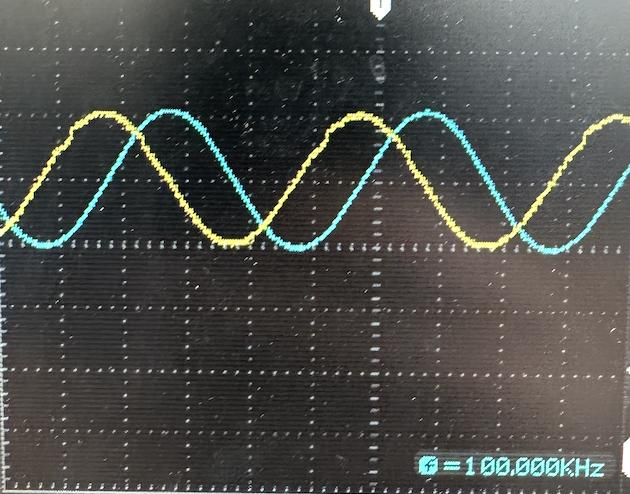 style="width:4.37292in;height:3.4318in" />
>
> g\. DAC2 h. DAC3

10\) For each of the above DAC# commands, make sure to route the DAC
output using the Test Board console. For example, after running DAC0,
use rows 0 and 4 to view the DAC outputs on the scope.

11\) Once the first 4 commands are sent, you can switch between DACs
without having to redo the setup. 12) Run the command “DAC2” on the DRC
console, and input “2” and “6” on the Test Board console.

13\) Converter 2 is the only Converter in which Channel A and B are on
different scope channels. You should see a quadrature modulated output,
where there are 2 sine waves 90 degrees apart.

> In the above, MIXF100 was used instead of MIXF1000, thus 100kHz.
>
> 27

DRC Design Verification Test
Creating a
Project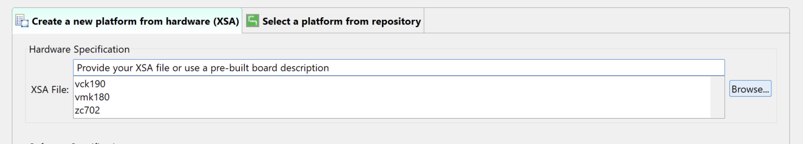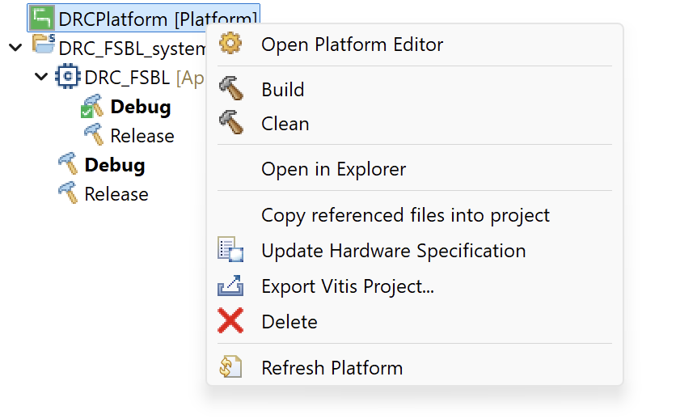

> 1\) Prepare the XSA file using Vivado 2023.1.
>
> a\. NOTE: When creating the Vivado Project, use the Octavo supplied
> BDF for the SiP w/ 1.8V QSPI flash.
>
> b\. NOTE: When placing the Zynq processor block in Vivado, run board
> automation and make sure the apply presets option is checked.
>
> c\. NOTE: Double click on the Zynq block and disable all gigabit
> transceivers. The preset enables GEM, SATA and will cause the FSBL to
> fail.
>
> 2\) Open Vitis 2023.1 and create a platform using said XSA file. a.
> File-\>New-\>Platform Project…
>
> 3\) Name the platform and click on “Next \>”
>
> 4\) You will see this page. Browse for your XSA file.
>
> 5\) Keep all setings unchanged and click on “Finish” a. Operating
> System is “standalone”
>
> b\. Processor should show the A53.
>
> 6\) Build the platform (Note: You will only see the DRCPlatform
> \[Platform\] at this stage)
>
> 7\) Once built, you will create an application project a. File
> -\>New-\> Application Project…
>
> 28
>
>  style="width:1.71028in;height:0.41805in" />DRC Design Verification
> Test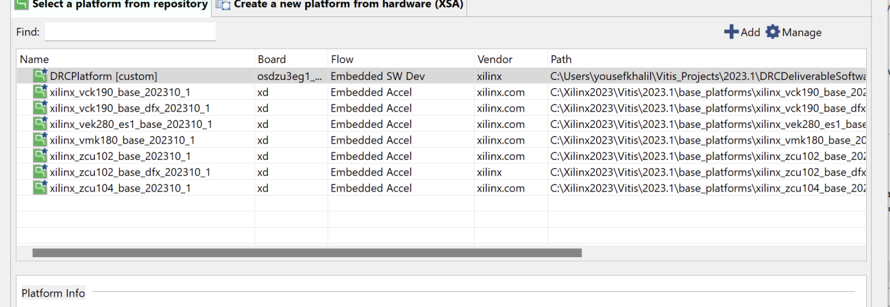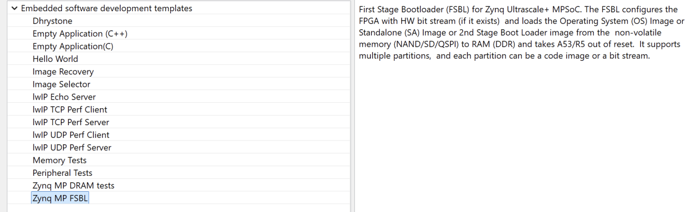

8\) Select the custom platform made in the previous steps and press
“Next \>”

9\) Name the application and proceed. The domain on the next page will
be the default. 10) Select either an empty application or Hello World
template.

11\) Press “Finish”

12\) You will now create another Application Project a.
File-\>New-\>Application Project…

13\) Select the custom platform just as in the previous project.

14\) This project will become the FSBL loaded for booting off QSPI
flash. Name the application in a way that it is clear to be the FSBL.

15\) Continue. When on the domain page, select new domain, and name it
to “fsbl_domain” instead of “standalone_domain.”

16\) When arriving at the templates page, select the “Zynq MP FSBL”
template.

17\) Press “Finish” and wait for Vitis to complete its task.

18\) Once complete, your file structure should be similar to this:

> 29
>
>  style="width:1.71028in;height:0.41805in" />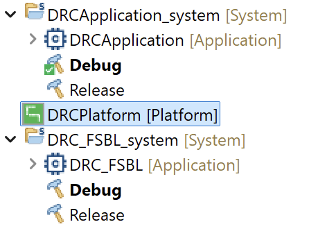 style="width:3.27778in;height:2.47222in" />DRC Design Verification
> Test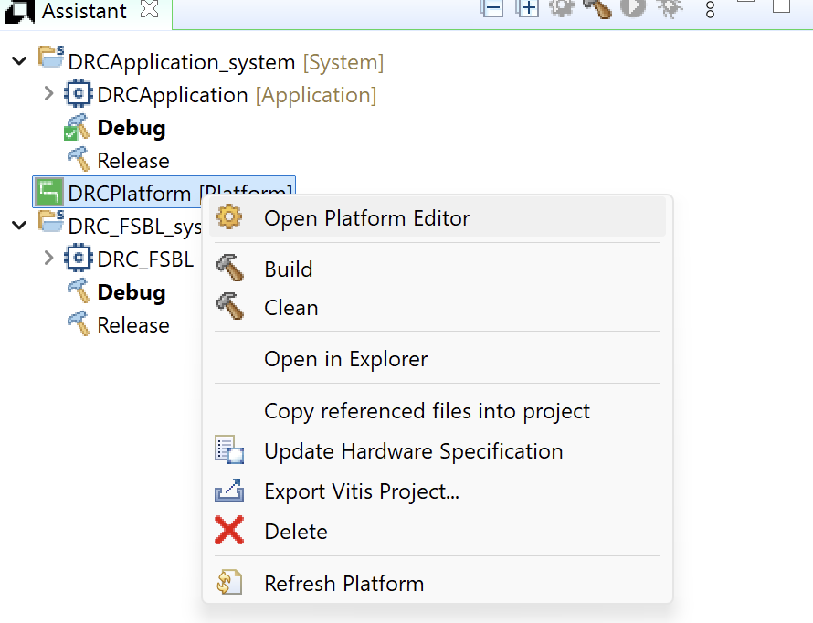 style="width:6.18056in;height:4.73611in" />

There should be 1 platform, and 2 system projects, with 1 application
project in each. 19) Open the Platform Editor.

20\) You should see the following:

> 30
>
>  style="width:1.71028in;height:0.41805in" />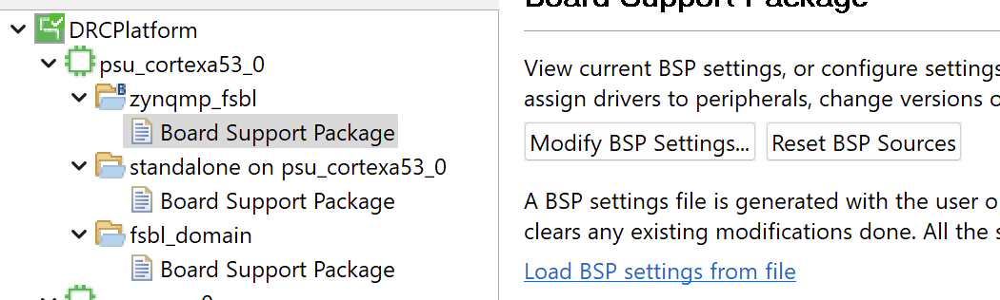DRC
> Design Verification Test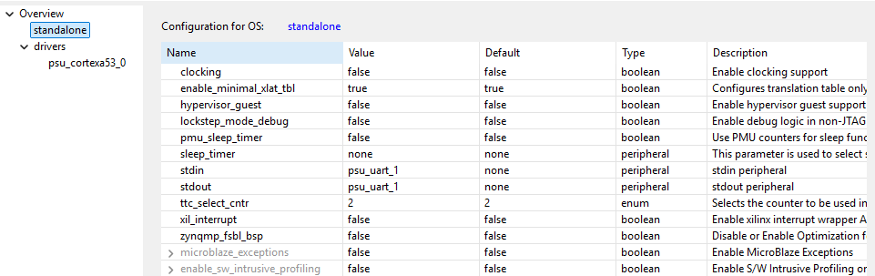 style="width:6.26875in;height:1.97639in" />
>
> For each “Board Support Package” under the custom platform
> (DRCPlatform in this case), click on “Modify BSP Setings…”

21\) Under standalone, change stdin/stdout to psu_coresight to allow
terminal interaction through jtag.

22\) Press Ok, and do this for all domains.

> a\. Note: Set Stdin and Stdout to psu_uart_1 to interface on the edge
> connector.

23\) Make any changes desired in the application whose template is the
hello world/empty project. 24) Build the platform.

25\) Build the FSBL project application. 26) Build the user application
project.

27\) Continue to the next section for preparing a boot image and
flashing the QSPI.

> 31
>
>  style="width:1.71028in;height:0.41805in" />DRC Design Verification
> Test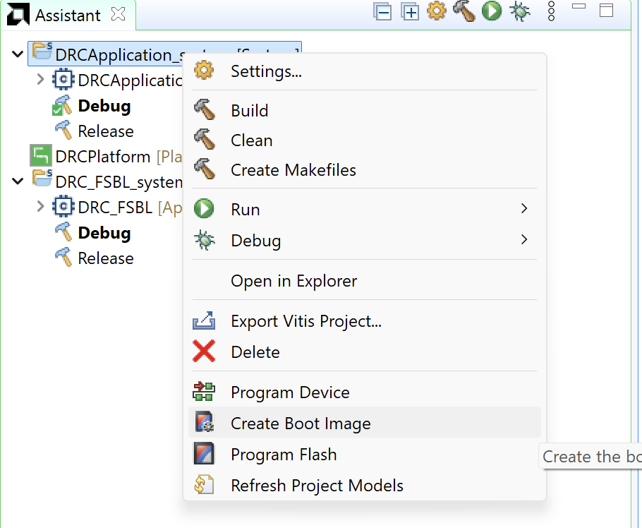 style="width:6.31944in;height:5.19444in" />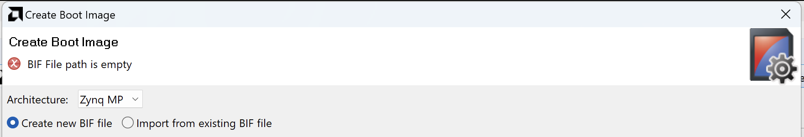

Preparing a Boot Image

> 1\) Right click on the user application system project and select
> Create Boot Image
>
> 2\) When the dialog appears, select “Create new BIF File,” and select
> Zync MP for architecture.
>
> 32
>
>  style="width:1.71028in;height:0.41805in" />DRC Design Verification
> Test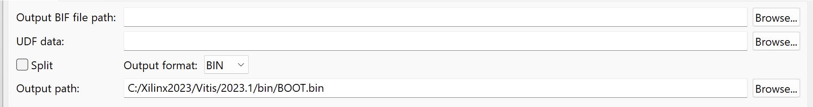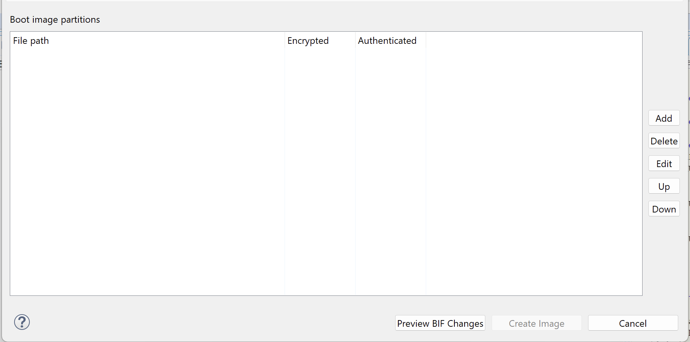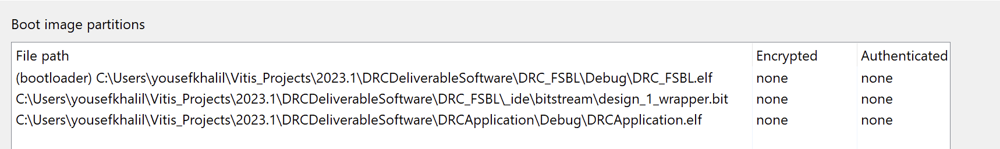
>
> 3\) Browse for a location to store the boot image and bif file.
>
> 4\) In the partitions:

Add the following:

> a\. FSBL application project application.elf as the bootloader
>
> i\. NOTE: Do not use the fsbl generated from the user application
> project. The “Zynq MP FSBL” template is designed to become the FSBL
> when booting from a storage medium.
>
> b\. The bitsream
>
> c\. User application project application.elf

You should end with this:

> 5\) Click on “Create Image” to create the boot image in the output
> path specified.
>
> 33
>
>  style="width:1.71028in;height:0.41805in" />DRC Design Verification
> Test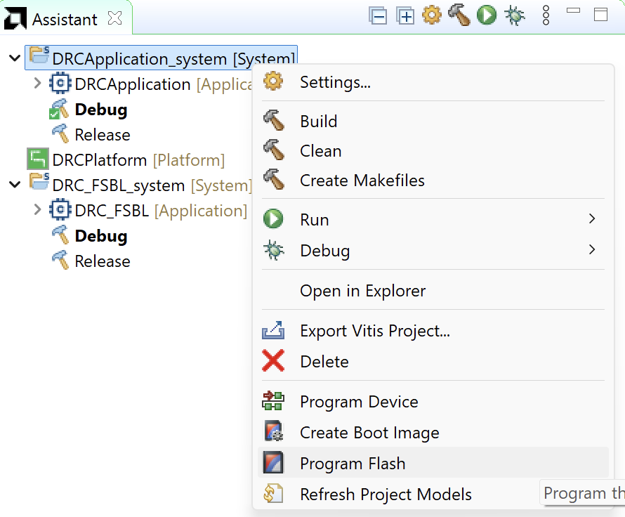 style="width:6.18056in;height:5.11111in" />

Programming QSPI Flash

> 1\) Make sure the boot mode jumper on edge connector interface board
> is set to JTAG boot mode : “OFF ON OFF OFF”.
>
> 2\) Apply power to the DRC.
>
> 3\) Connect the DRC to the PC and make sure it is showing up in the
> targets list in Vitis.
>
> 4\) In the Assistant, right click on the user application system
> project and select “Program Flash.”
>
> 34
>
>  style="width:1.71028in;height:0.41805in" />DRC Design Verification
> Test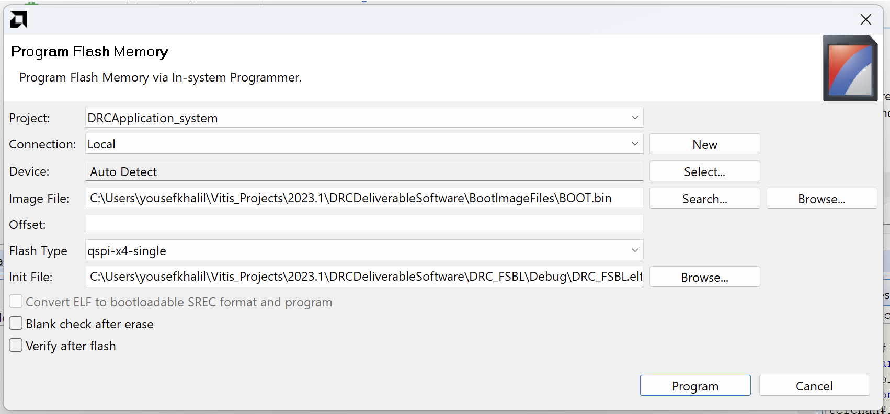
>
> 5\) The following page appears. Use these setings:

For Image File, browse to the location in which the BOOT.bin was
generated in from the previous step. Make sure Flash type is
qspi-x4-single. The init File is the FSBL application that was used
before as the bootloader.

> 6\) Press “Program”
>
> 7\) Verify the device successfully programs by switching the boot
> jumper to QSPI “OFF OFF OFF OFF” and power cycling the system.

Additionally, the BOOT.bin file can be stored in an SD Card, and the DRC
can boot of said SD card when the edge connector interface board jumpers
are set to “”

> 35
